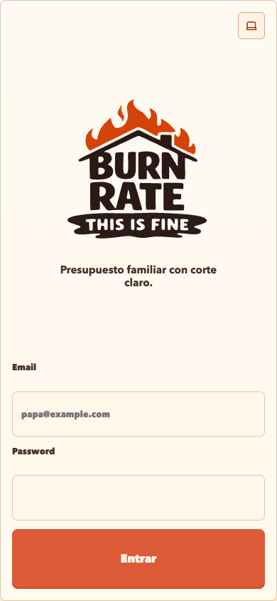
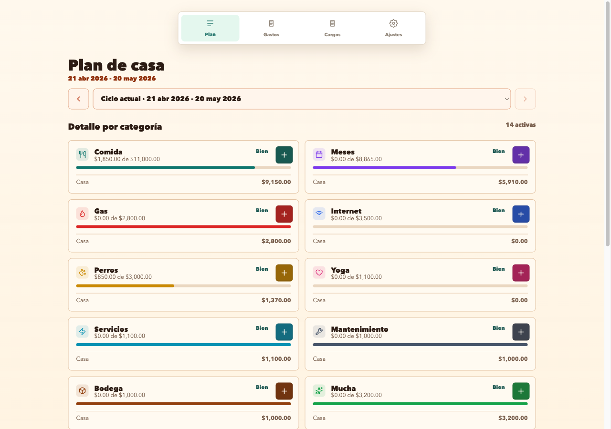
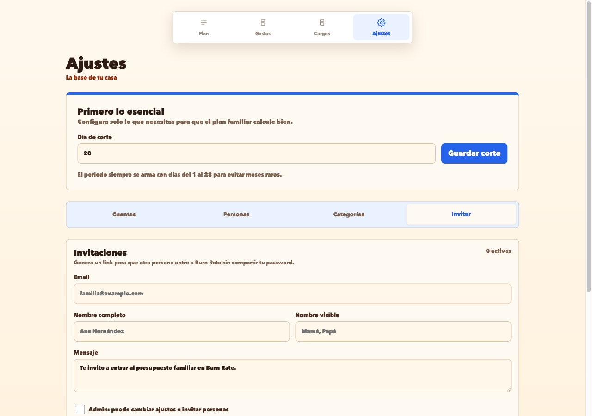

<p align="center">
  
</p>

# Burn Rate

Burn Rate es una aplicación familiar y autohospedada para planear el gasto de la casa. Permite registrar presupuestos mensuales por categoría, gastos, cuentas de pago, cargos recurrentes y compras a meses sin intereses.

La instalación objetivo de esta versión es sencilla: un contenedor `app` que sirve la interfaz Vue y la API Django bajo el mismo origen, más un servicio `db` con PostgreSQL persistente. Está pensada para correr detrás de una VPN o un proxy privado, no como una aplicación pública abierta a internet.

## Capturas







## Qué incluye

- Flujo de bienvenida para reclamar el primer administrador cuando la base de datos no tiene usuarios.
- Registro del primer usuario desde el navegador con email, nombre completo, nombre visible y password.
- Invitaciones creadas por administradores para sumar a otra persona de la casa.
- Envío de invitación por email si SMTP está configurado.
- Link copiable de invitación aunque no exista configuración de email.
- Sesiones autorrenovables por actividad, regreso a pestaña visible y refresco periódico.
- Contenedor único de aplicación con migraciones automáticas al arrancar.
- PostgreSQL privado dentro de Docker Compose por defecto.
- Endpoint `/healthz/` para healthcheck del contenedor.

## Stack

- Backend: Django, Django REST Framework, PostgreSQL, Gunicorn y WhiteNoise.
- Frontend: Vue 3, TypeScript, Vite y Pinia.
- Runtime Docker: build multi-stage con Node/pnpm para compilar Vue y Python 3.12 con `uv` para Django.
- Documentación: notas técnicas versionadas en `docs/`.

## Instalación con Docker

Requisitos:

- Docker y Docker Compose.
- Un dominio, hostname local o IP accesible desde tu VPN.
- Un secreto largo para `DJANGO_SECRET_KEY`.
- Credenciales SMTP solo si quieres enviar invitaciones por email.

1. Copia el archivo de ejemplo:

```bash
cp .env.example .env
```

2. Edita `.env`. Como mínimo cambia:

```env
DB_PASSWORD=usa-una-password-real
DJANGO_SECRET_KEY=usa-un-secreto-largo-y-aleatorio
DJANGO_ALLOWED_HOSTS=localhost,127.0.0.1,tu-host.local
DJANGO_CSRF_TRUSTED_ORIGINS=http://localhost:8000,http://tu-host.local:8000
BURN_RATE_PUBLIC_URL=http://tu-host.local:8000
```

3. Levanta la aplicación:

```bash
docker compose up --build app
```

4. Abre la app:

```text
http://127.0.0.1:8000
```

Si la instalación es nueva, Burn Rate mostrará el flujo de bienvenida para crear el primer administrador. No hace falta correr un comando manual para crear ese usuario.

5. Verifica el healthcheck:

```text
http://127.0.0.1:8000/healthz/
```

La base de datos no publica puertos al host por defecto. Solo se expone la aplicación en `${APP_BIND:-127.0.0.1}:${APP_PORT:-8000}`.

## Flujo inicial

1. En una base limpia, la pantalla inicial detecta que no hay usuarios y muestra la bienvenida.
2. El primer usuario registra email, nombre completo, nombre visible y password.
3. Ese usuario queda como `staff` y `superuser`, se crea su miembro de casa y la sesión inicia automáticamente.
4. En `Ajustes` se configuran cuentas, personas, categorías y día de corte.
5. Desde `Ajustes > Invitar`, el admin puede invitar a una segunda persona.
6. La invitación captura email, nombre completo, nombre visible, mensaje personalizado y si la persona será admin.
7. Si hay SMTP y `BURN_RATE_PUBLIC_URL`, se envía email. Si no, el admin copia el link y lo manda por el canal que prefiera.
8. La persona invitada abre el link, confirma o corrige sus datos, define password y entra con su nombre visible.

El nombre visible es el que se usa dentro de la aplicación. Puede ser un nombre corto o un apodo familiar, por ejemplo `Mamá`, `Papá`, `Casa`, `Lau` o `Fer`.

## Invitaciones por email

El email es opcional. Burn Rate solo intenta enviar invitaciones cuando existen las credenciales necesarias:

```env
BURN_RATE_PUBLIC_URL=https://burnrate.tu-dominio.local
EMAIL_HOST=smtp.tu-proveedor.com
EMAIL_PORT=587
EMAIL_HOST_USER=usuario-smtp
EMAIL_HOST_PASSWORD=password-smtp
EMAIL_USE_TLS=true
EMAIL_USE_SSL=false
DEFAULT_FROM_EMAIL=Burn Rate <burnrate@tu-dominio.local>
```

Si estas variables no están completas, el flujo sigue funcionando y muestra el link copiable. Las invitaciones expiran por defecto en 14 días y son de un solo uso.

## Variables principales

| Variable | Uso |
| --- | --- |
| `APP_BIND` | Interfaz del host donde Docker publica la app. Por defecto `127.0.0.1`. |
| `APP_PORT` | Puerto del host para acceder a Burn Rate. Por defecto `8000`. |
| `DB_NAME`, `DB_USER`, `DB_PASSWORD` | Credenciales de PostgreSQL. |
| `DB_HOST`, `DB_PORT` | En Docker Compose, el contenedor `app` usa `DB_HOST=db`. |
| `DJANGO_SECRET_KEY` | Obligatorio en producción. Debe ser largo y privado. |
| `DJANGO_DEBUG` | Debe ser `false` fuera de desarrollo. |
| `DJANGO_ALLOWED_HOSTS` | Hosts válidos para Django, separados por coma. |
| `DJANGO_CSRF_TRUSTED_ORIGINS` | Orígenes confiables para POST desde navegador. Incluye protocolo. |
| `DJANGO_SESSION_COOKIE_AGE` | Duración de sesión en segundos. Por defecto 30 días. |
| `DJANGO_SESSION_SAVE_EVERY_REQUEST` | Renueva la sesión en cada request cuando está en `true`. |
| `DJANGO_SESSION_COOKIE_SECURE` | Usa cookies de sesión solo por HTTPS cuando está en `true`. |
| `DJANGO_CSRF_COOKIE_SECURE` | Usa cookie CSRF solo por HTTPS cuando está en `true`. |
| `DJANGO_TRUST_X_FORWARDED_PROTO` | Activa soporte para proxy HTTPS con `X-Forwarded-Proto`. |
| `INVITATION_TTL_DAYS` | Días de vigencia de una invitación. |
| `BURN_RATE_PUBLIC_URL` | URL pública usada para construir links de invitación. |
| `BURN_RATE_INVITATION_ACCEPT_URL` | URL opcional si el frontend de aceptación vive en otra ruta/origen. |
| `RUN_MIGRATIONS` | Ejecuta migraciones al arrancar el contenedor. Por defecto `true`. |
| `COLLECT_STATIC` | Ejecuta `collectstatic` al arrancar el contenedor. Por defecto `true`. |
| `WAIT_FOR_DB` | Espera a PostgreSQL antes de migrar. Por defecto `true`. |
| `GUNICORN_WORKERS`, `GUNICORN_TIMEOUT` | Ajustes del proceso Gunicorn. |

## Actualización por nuevo contenedor

Burn Rate está diseñado para actualizarse reemplazando el contenedor de aplicación. Los datos viven en PostgreSQL, dentro del volumen `burn_rate_postgres`.

```bash
docker compose down
docker compose up --build app
```

En cada arranque, si `RUN_MIGRATIONS=true`, el contenedor aplica migraciones pendientes antes de iniciar Gunicorn.

Para respaldar la base:

```bash
docker compose exec db pg_dump -U "$DB_USER" "$DB_NAME" > burn_rate_backup.sql
```

## Seguridad esperada

Esta versión busca una seguridad razonable para uso familiar detrás de VPN:

- No hay registro público general.
- El primer admin solo se puede reclamar cuando no existe ningún usuario.
- Las invitaciones usan token con hash, expiración, revocación y aceptación de un solo uso.
- Login y logout usan CSRF.
- Las cookies son `HttpOnly` y `SameSite=Lax`.
- Las sesiones se renuevan de forma deslizante.
- Los cambios inseguros en cuentas, personas, categorías y ajustes requieren admin.

Para instalación con HTTPS detrás de proxy, configura:

```env
DJANGO_SESSION_COOKIE_SECURE=true
DJANGO_CSRF_COOKIE_SECURE=true
DJANGO_TRUST_X_FORWARDED_PROTO=true
DJANGO_SECURE_SSL_REDIRECT=true
DJANGO_SECURE_HSTS_SECONDS=31536000
```

No expongas PostgreSQL directamente al host o a internet. Si necesitas exponer Burn Rate fuera de tu red, ponlo detrás de VPN, túnel privado o reverse proxy con TLS.

## Desarrollo local

1. Levanta solo PostgreSQL:

```bash
docker compose up -d db
```

2. Inicia Django:

```bash
cd backend
uv sync
uv run python manage.py migrate
uv run python manage.py create_local_user admin admin@example.com
uv run python manage.py runserver 0.0.0.0:8001
```

3. Inicia Vite:

```bash
cd frontend
pnpm install
pnpm dev
```

La interfaz queda en `http://localhost:5173` y Vite proxya `/api` hacia Django en `http://localhost:8001`.

## Pruebas y checks

Backend:

```bash
cd backend
USE_SQLITE_FOR_TESTS=true uv run pytest
USE_SQLITE_FOR_TESTS=true uv run python manage.py check
```

Frontend:

```bash
cd frontend
pnpm test
pnpm build
```

Docker:

```bash
docker compose config
docker compose build app
```

## Estructura del proyecto

```text
.
├── backend/                 # Django, DRF, migraciones y tests de API
├── frontend/                # Vue 3, TypeScript, Vite y Pinia
├── docs/                    # Documentación técnica e historial
├── docs/screenshots/        # Capturas usadas en este README
├── Logos/                   # Logos SVG de Burn Rate
├── Dockerfile               # Build multi-stage de frontend + backend
├── docker-compose.yml       # Servicios app + db
├── docker-entrypoint.sh     # Espera DB, migra, collectstatic y arranca app
└── .env.example             # Contrato de variables de entorno
```

## Documentación interna

Cada cambio funcional debe actualizar la documentación en `docs/` y agregar una entrada en `docs/agent-history.md`. Eso deja trazable qué cambió, por qué cambió y con qué verificaciones se cerró.
